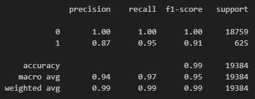

# Module 12 Report Template

## Overview of the Analysis

In this section, describe the analysis you completed for the machine learning models used in this Challenge. This might include:

* The purpose of this was to train and understand machine learning models. We wanted to use machine learning for loan risks. The goal was to build a model that can help someone identify creditworthyness of borrowers.

* The financial information that we had were looking at was loan status. Loan_size, interest_rate, borrower_income, debt_to_income,num_of_accounts, derogatory_marks, total_debt, and loan_status were used for example.

* I added a value counts to understand the loan status. The value set of 0 was 75036, and the vlaue set of 1 had 2500. This means the the value set of 0 is more "healthy".

* The stages of the mahcine learning process were to create a datafram from the data I had, and then split the data intot two groups, training and testing. Make a logistic regression model and then make predictions based on the logistic regression model. The last stage is to evaluate my results. In this case I was looking at precision and accuracy scores.

* I used logistic regression to help calculate the probability of loan risk and to help indentify creditworthiness of borrowers.

## Results

Using bulleted lists, describe the accuracy scores and the precision and recall scores of all machine learning models.

* Machine Learning Model 1:
    * Description of Model 1 Accuracy, Precision, and Recall scores.

## Summary

Summarize the results of the machine learning models, and include a recommendation on the model to use, if any. For example:

* Which one seems to perform best? How do you know it performs best?
* Does performance depend on the problem we are trying to solve? (For example, is it more important to predict the `1`'s, or predict the `0`'s? )

If you do not recommend any of the models, please justify your reasoning.
